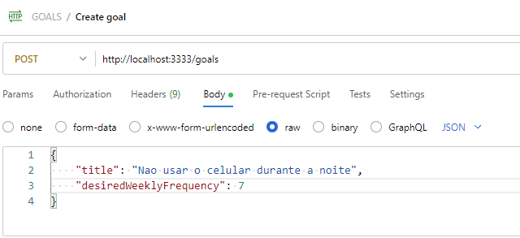
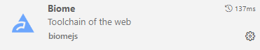
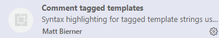

# Projeto In Orbit 

# Dependencias
```
$ npm init -y
$ npm i typescript -D
$ npx tsc --init
$ npm i @types/node -tsx -D
$ npm i fastify
$ npm i drizzle-orm
$ npm i drizzle-kit -D
$ npm i zod
$ npm i postgres
$ npm i @paralleldrive/cuid2
$ npm i dayjs
$ npm i fastify-type-provider-zod
```

# Configuracoes 
### no arquivo tsconfig.json - acesse o site (tsconfig base)
```
    {
        "$schema": "https://json.schemastore.org/tsconfig",
        "_version": "20.1.0",

        "compilerOptions": {
            "lib": ["es2023"],
            "module": "node16",
            "target": "es2022",

            "strict": true,
            "esModuleInterop": true,
            "skipLibCheck": true,
            "moduleResolution": "node16"
        }
    }
```

### no arquivo package.json, edite o script do arquivo 
    
```
    "scripts": {
        "dev": "tsx --env-file .env watch src/http/server.ts"
    },
```


# Database 

## Seed: O arquivo Seed é responsável por inserir dados iniciais no banco de dados, como usuários, categorias, produtos, etc. Isso ajuda a criar um ambiente de desenvolvimento mais realista e facilita a testagem e depuração da aplicação por outros desenvolvedores.

```
$ touch src/db/seed.ts
```
# Play no Projeto

```
$ npm run dev
```

# Play no Docker + Postgres

```
$ docker compose up -d
```

# Play no Drizzle-kit

```
$ npx drizzle-kit generate
$ npx drizzle-kit migrate
$ npx drizzle-kit studio
```

# Postman 
### primeira rota (CreateGoal)



# Tabela de Erros


| Tipo | issues | soluctions |
|----------|----------|----------|
| triggerUncaughtException  | app.get('pending-goals',  | app.get('/pending-goals',   |

# Snipets




##  Ola, meu nome é Tarcisio Valentim.
### 💻 Fullstack Developer | iOS & Android | ReactJs | NodeJs.


Eu sou desenvolvedor de software desde 2020. Desde 2018, combino meu trabalho desenvolvendo aplicativos com a criação de conteúdo educacional sobre programação.

Pode encontrarnos em:


<div style="display: flex; justify-content: center;">

<a class="social" href="mailto:tarcisio.word@gmail.com" alt="Gmail" >
  
</a>

<a class="social" href="https://www.linkedin.com/in/devtvas/" alt="Linkedin" >
  
</a>

<a class="social" href="https://api.whatsapp.com/send?phone=5562998025403" alt="WhatsApp" >
  
</a>

</div>

> ##### Se consideras o conteúdo útil, apoia-o dando "★ Star" no repositório. Obrigado!